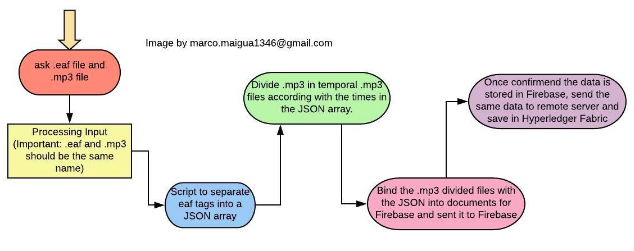

## Overview of Media Lengua

This project has as goal to preserve an indigenous language that is dying by storing its relevant linguistic characteristics in the cloud as well as in a dedicated server. 

Moreover, this app facilitates the researcher the processing of data stored in eaf files. Therefore, this app process data and store it. We decided to use a strong software architecture and the latest technologies of software development for different platforms. 

We are using Google Cloud Services(such as Firebase) and Blockchain Technologies(such as Hyperledger Composer) as backend systems. Ultimately, we are using React and React Native for the UI and Redux-Thunk for Data Modeling-Middleware.

## Objectives

-Upload files by browsing in the computer a eaf file and an mp3 file to save it in the cloud and in a remote server

-Table of sentences in media lengua with a search bar that finds results in any column of the data

-The user is able to play the sound of an specific sentence. It would download that specific mp3 file attached and then play it in the computer. 

-The source code has the capacity of compiling in android, os and in the web browser. 

## Architecture
The data is saved in firebase database. Although should be moved to a local host or with blockchain

## Processing of Files

*Firebase Cloud functions is not being used yet. So far the react front end is the most advanced. 

## New architecture
Its mainly going to use mysql and best practices of deployment, the database must be very well structured and the following is the best modeling possible:

Vocabulary(must be a modal that shows up in the screen, an extra component):
-id
-kichwa1
-kichwa2
-kichwa3
-Spanish
-English

Conversation Active:
-id
-belongsto
-text
-order

Conversation Passive:
-id
-belongsto
-text
-order

Conversation:
-id
-description

Gramatic Rules:
-id
-title 
-examples
-description

### TODO:
-fix apache configuration to just fit the front end deployment
-create tables of the schema proposed above
-create backup services of the database
